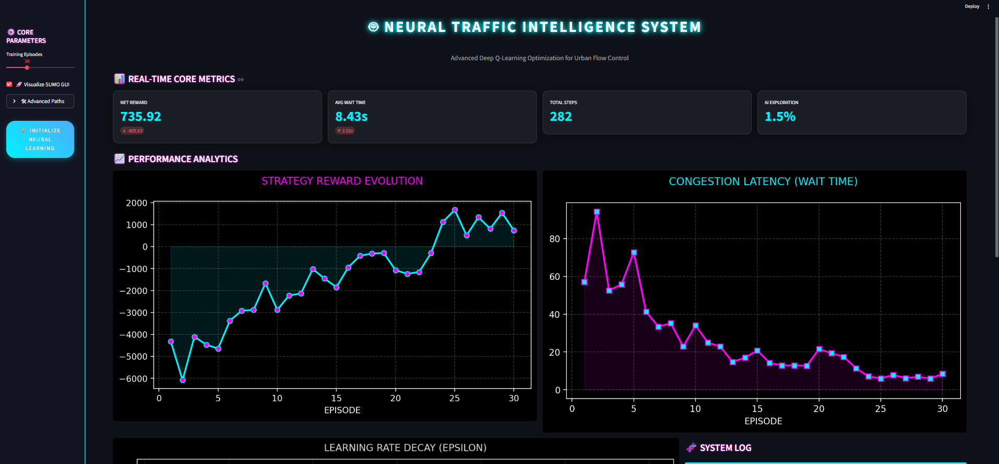

### 🛣 SUMO Traffic Simulation




### 📊 Training Performance (Reward/Loss Graph)


### 🚥 Intersection View


---


---

## 🛠 Setup

### 1️⃣ Install Dependencies

```bash
pip install -r requirements.txt
```

---

### 2️⃣ Configure SUMO

The script tries to automatically detect your SUMO installation.

✅ If SUMO is installed normally, it should work automatically.

❌ If not detected:

Open `sumo_traffic_rl.py` and update:

```python
CUSTOM_SUMO_PATH = r"C:\Path\To\Your\Sumo"
```

Example:

```python
CUSTOM_SUMO_PATH = r"C:\Program Files\Eclipse\Sumo"
```

---

## ▶ Running the Project

Run the main training file:

```bash
python sumo_traffic_rl.py
```

---

## 📁 Project Structure

```
Traffic-Light-RL/
│
├── sumo_traffic_rl.py      # Main training script
├── cross3ltl.sumocfg      # SUMO configuration
├── net.net.xml            # Road network definition
├── input_routes.rou.xml   # Traffic routes
├── requirements.txt
└── images/
```

---

## 🧠 Technology Stack

* Python
* Deep Q-Network (DQN)
* SUMO Simulator
* NumPy
* TensorFlow / PyTorch (if used)

---

## ❗ Troubleshooting

### ⚠ Unicode / Emoji Error

✔ Script optimized for Windows CMD & PowerShell

---

### ⚠ SUMO_HOME Not Set

Error:

```
SUMO_HOME not set
```

✔ Solution:

* Verify SUMO installation
* Set correct path in:

```python
CUSTOM_SUMO_PATH
```

---

## 📌 Future Improvements

* Multi-intersection support
* PPO / A3C RL algorithms
* Real-time visualization dashboard
* Reward function optimization

---

## 👨‍💻 Author

**Ashraful Islam**
CUET | CSE
Traffic Control using Reinforcement Learning

